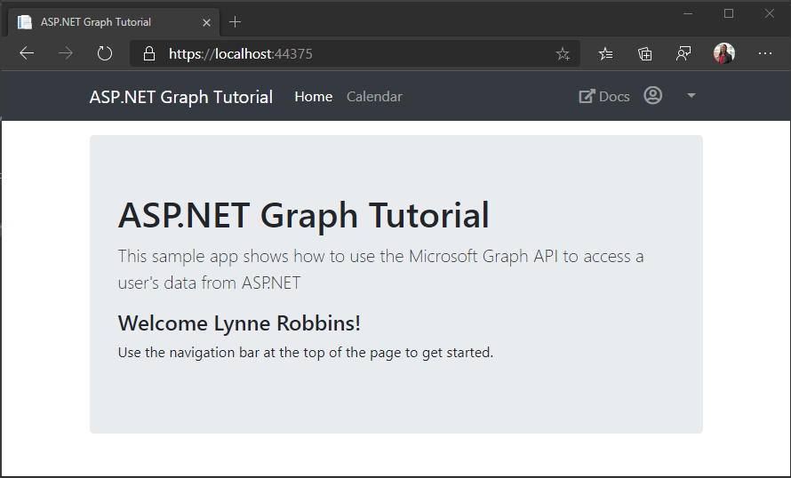
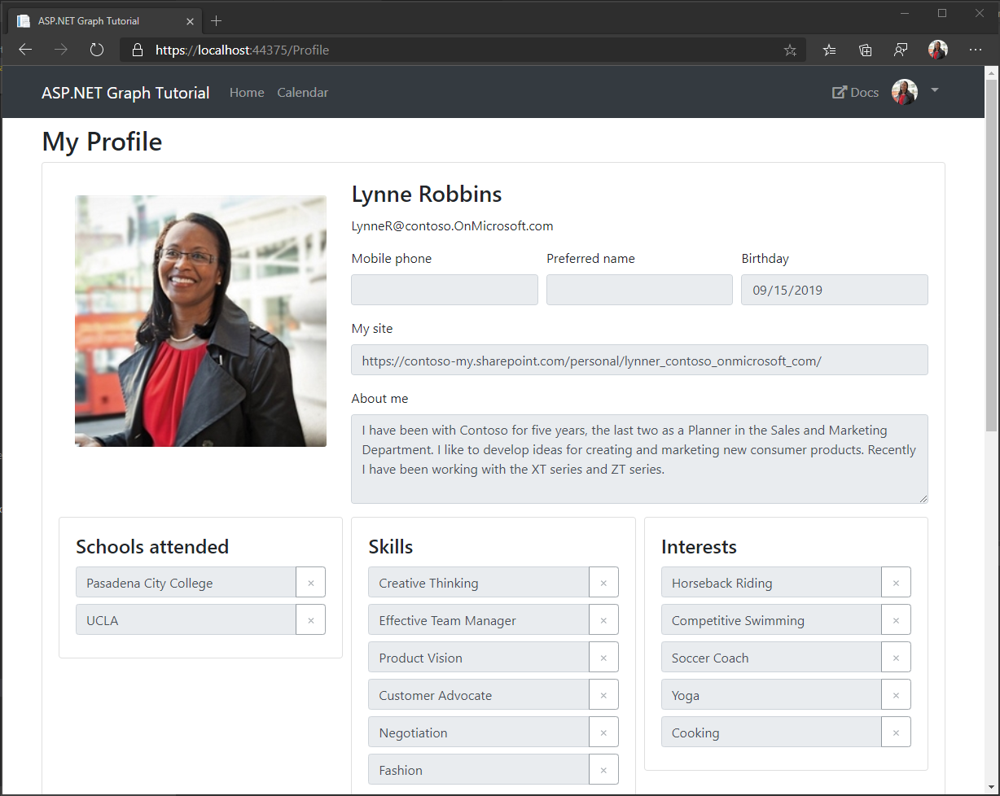
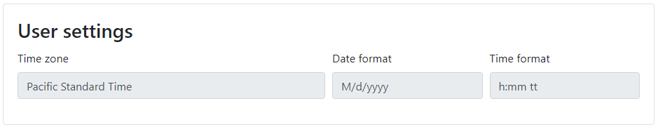
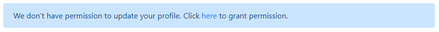

# Tutorial: Add user profile features to an ASP.NET MVC web app using Microsoft Graph

This tutorial shows you how to add user profile features to an ASP.NET MVC web app using Microsoft Graph. Microsoft Graph provides information about the signed-in user from Azure Active Directory, Exchange Online, and the user's Office profile. You can use this information to personalize the user's experience in your app. For example, you might use the user's profile photo as an avatar, or display dates and times in the user's preferred time zone. You can also allow the user to update their profile.

For a complete code sample that includes the code from this tutorial, see [this](https://github.com/microsoftgraph/aspnet-mvc-sample).

In this tutorial, you learn how to:

> [!div class="checklist"]
>
> - Get and display the user's profile photo
> - Get and display the user's profile information
> - Get and display the user's mailbox settings
> - Request additional permissions scopes after sign-in
> - Update the user's profile photo
> - Update the user's profile information

If you don't have a Microsoft 365 subscription, join the [Office 365 developer program](https://developer.microsoft.com/office/dev-program) to get a free subscription.

## Prerequisites

- Visual Studio 2019
- Completed project from [Build ASP.NET MVC apps with Microsoft Graph](https://docs.microsoft.com/graph/tutorials/aspnet)
- A Microsoft 365 subscription

## Get and display the user's profile photo

When the user signs in to the sample application, the right-hand side of the navigation bar displays a placeholder user avatar. In this procedure, you'll update the application to replace the placeholder with the user's profile photo from Microsoft Graph.

Here's what the application navigation bar looks like before adding the user's photo.



1. Open the **graph-tutorial.sln** file in Visual Studio, then open **Helpers/GraphHelper.cs**.
1. Add the following `using` statements at the top of the file.

    ```csharp
    using System.IO;
    using System;
    ```

1. Add the following function to the `GraphHelper` class to get the user's photo and encode it as a data URI.

    ```csharp
    public static async Task<string> GetUserPhotoAsDataUriAsync(GraphServiceClient graphClient = null, string size = null)
    {
       if (graphClient == null)
       {
             graphClient = GetAuthenticatedClient();
       }

       Stream photoStream;

       // If no size specified, get the default photo
       if (string.IsNullOrEmpty(size))
       {
             photoStream = await graphClient.Me
                .Photo.Content.Request().GetAsync();
       }
       else
       {
             photoStream = await graphClient.Me
                .Photos[size].Content.Request().GetAsync();
       }

       // Copy the stream to a MemoryStream to get the data
       // out as a byte array
       var memoryStream = new MemoryStream();
       photoStream.CopyTo(memoryStream);

       var photoBytes = memoryStream.ToArray();

       // Return a data URI
       return $"data:image/png;base64,{Convert.ToBase64String(photoBytes)}";
    }
    ```

1. Add the following to the `GetUserDetailsAsync` function before the `return` statement.

    ```csharp
    // Get the user's profile photo
    var profilePhotoUri = await GetUserPhotoAsDataUriAsync(graphClient, "48x48");
    ```

1. Replace the `Avatar = string.Empty,` line in the `GetUserDetailsAsync` function with the following.

    ```csharp
    Avatar = profilePhotoUri,
    ```

1. Save all of your changes, then select **Debug** > **Start Debugging** or press **F5** to run the application.
1. Sign into the application using the **Click here to sign in** button or the **Sign In** navigation bar link.

After successfully signing in, you should see the user's profile photo in the upper right corner. If you still see the placeholder, make sure that your user account has a profile photo by signing in at [https://www.office.com](https://www.office.com).


## Get and display the user's profile information

Now let's add a profile page to the app, and use Microsoft Graph to fill it in.

1. In **Helpers/GraphHelper.cs**, add the following function to get the user's profile.

    ```csharp
    public static async Task<User> GetUserProfileAsync()
    {
        var graphClient = GetAuthenticatedClient();

        // The default set of properties on a user object is small,
        // you must request non-default properties explicitly
        var userProfile = await graphClient.Me
            .Request()
            .Select(u => new
            {
                u.AboutMe,
                u.Birthday,
                u.BusinessPhones,
                u.City,
                u.Country,
                u.Department,
                u.DisplayName,
                u.EmployeeId,
                u.Interests,
                u.JobTitle,
                u.MobilePhone,
                u.MySite,
                u.OfficeLocation,
                u.PostalCode,
                u.Responsibilities,
                u.Schools,
                u.Skills,
                u.State,
                u.StreetAddress
            })
            .GetAsync();

        return userProfile;
    }
    ```

1. In the **Solution Explorer** in Visual Studio, select the **Controllers** folder.
1. Open the context menu by right-clicking the **Controllers** folder or pressing **SHIFT** + **F10**.
1. Select **Add** > **Controller...**.
1. Select **MVC 5 Controller - Empty** and choose **Add**. Name the controller `ProfileController` and choose **Add**.
1. Open the **ProfileController.cs** file and replace its entire contents with the following code.

    ```csharp
    using graph_tutorial.Helpers;
    using graph_tutorial.Models;
    using System.Threading.Tasks;
    using System.Web.Mvc;

    namespace graph_tutorial.Controllers
    {
        public class ProfileController : BaseController
        {
            // GET: Profile
            [Authorize]
            public async Task<ActionResult> Index()
            {
                // Temporary
                ViewBag.ConsentUri = string.Empty;

                var userPhoto = await GraphHelper.GetUserPhotoAsDataUriAsync();
                ViewBag.FullSizePhoto = userPhoto;

                var userProfile = await GraphHelper.GetUserProfileAsync();

                return View(userProfile);
            }
        }
    }
    ```

### Add views

Let's implement a view for the user's profile, and a partial view for the parts of the user's profile that are lists.

1. In **Solution Explorer**, expand the **Views** folder, then select the **Shared** folder.
1. Open the context menu for the **Profile** folder and choose **Add** > **MVC 5 Partial Page (Razor)**.
1. Name the page `_ModifiableList` and choose **OK**.
1. Open the **_ModifiableList.cshtml** file and add the following code.

    ```cshtml
    @model List<string>
    @{
        var canUpdate = (bool)ViewData["canUpdate"];
    }

    <div class="card">
        <div class="card-body">
            <h4 class="card-title">@ViewData["title"]</h4>
            @foreach (var item in Model)
            {
                <div class="input-group mb-2">
                    <input type="text" form="@ViewData["form"]" class="form-control existing-item-input" name="@ViewData["name"]" value="@item" @{ @(canUpdate ? null : new { disabled = "disabled" })  } ; />
                    <div class="input-group-append">
                        <button type="button" class="btn btn-outline-secondary remove-button" @{ @(canUpdate ? null : new { disabled = "disabled" })  } ;>
                            <span>&times;</span>
                        </button>
                    </div>
                </div>
            }
            @if (canUpdate)
            {
                <div class="input-group">
                    <input type="text" class="form-control new-item-input" data-name="@ViewData["name"]" placeholder="@ViewData["placeholder"]" />
                    <div class="input-group-append">
                        <button class="btn btn-secondary add-new-item" type="button">+</button>
                    </div>
                </div>
            }
        </div>
    </div>
    ```

1. In **Solution Explorer**, expand the **Views** folder, then select the **Profile** folder.
1. Open the context menu for the **Profile** folder and choose **Add** > **MVC 5 View Page (Razor)**.
1. Name the page `Index` and choose **OK**.
1. Open the **Index.cshtml** file and add the following code.

    ```cshtml
    @model Microsoft.Graph.User

    @{
        ViewBag.Title = "Index";
        var canUpdate = ViewBag.ConsentUri == null;
    }

    <h2>My Profile</h2>

    <form id="profile-form" action="/Profile/Update" method="post"></form>
    <form id="photo-form" action="/Profile/UpdatePhoto" method="post" enctype="multipart/form-data"></form>

    <div class="card mb-4" id="user-card">
        <div class="card-body">
            <div class="form-row">
                <div class="col-md-4">
                    <div class="card-body">
                        
                        <div class="custom-file mb-1">
                            <input type="file" form="photo-form" class="custom-file-input" id="profilePhoto" name="profilePhoto" accept="image/jpeg, image/png" @{ @(canUpdate ? null : new { disabled = "disabled" })  } ; />
                            <label for="profilePhoto" class="custom-file-label">Choose new photo</label>
                        </div>
                        <button type="submit" form="photo-form" class="btn btn-primary btn-block">Update my photo</button>
                    </div>
                </div>
                <div class="col-md-8">
                    <h3 class="card-title">@ViewBag.User.DisplayName</h3>
                    <p class="card-text">@ViewBag.User.Email</p>
                    <div class="form-row">
                        <div class="form-group col-md-4">
                            <label for="mobilePhone">Mobile phone</label>
                            <input type="tel" form="profile-form" class="form-control" id="mobilePhone" name="mobilePhone" value="@Model.MobilePhone" @{ @(canUpdate ? null : new { disabled = "disabled" })  } ; />
                            <input type="hidden" form="profile-form" name="originalMobilePhone" value="@Model.MobilePhone" />
                        </div>
                        <div class="form-group col-md-4">
                            <label for="preferredName">Preferred name</label>
                            <input type="text" form="profile-form" class="form-control" id="preferredName" name="preferredName" value="@Model.PreferredName" @{ @(canUpdate ? null : new { disabled = "disabled" })  } ; />
                            <input type="hidden" form="profile-form" name="originalPreferredName" value="@Model.PreferredName" />
                        </div>
                        <div class="form-group col-md-4">
                            <label for="birthday">Birthday</label>
                            <input type="date" form="profile-form" class="form-control" id="birthday" name="birthday" value="@Model.Birthday.Value.ToString("yyyy-MM-dd")" @{ @(canUpdate ? null : new { disabled = "disabled" })  } ; />
                            <input type="hidden" form="profile-form" name="originalBirthDay" value="@Model.Birthday.Value.ToString("yyyy-MM-dd")" />
                        </div>
                    </div>
                    <div class="form-group">
                        <label for="mySite">My site</label>
                        <input type="url" form="profile-form" class="form-control" id="mySite" name="mySite" value="@Model.MySite" @{ @(canUpdate ? null : new { disabled = "disabled" })  } ; />
                        <input type="hidden" form="profile-form" name="originalMySite" value="@Model.MySite" />
                    </div>
                    <div class="form-group">
                        <label for="aboutMe">About me</label>
                        <textarea class="form-control" form="profile-form" id="aboutMe" name="aboutMe" rows="4" @{ @(canUpdate ? null : new { disabled = "disabled" })  } ;>@Model.AboutMe</textarea>
                        <input type="hidden" form="profile-form" name="originalAboutMe" value="@Model.AboutMe" />
                    </div>
                </div>
            </div>

            <div class="form-row row-cols-1 row-cols-md-3">
                <div class="col mb-4">
                    @Html.Partial("_ModifiableList", Model.Schools, new ViewDataDictionary { { "title", "Schools attended" }, { "form", "profile-form" }, { "placeholder", "Add a school" }, { "name", "schools[]" }, { "canUpdate", canUpdate } })
                    <input type="hidden" form="profile-form" name="originalSchools" value="@string.Join(";", Model.Schools.ToArray())" />
                </div>
                <div class="col mb-4">
                    @Html.Partial("_ModifiableList", Model.Skills, new ViewDataDictionary { { "title", "Skills" }, { "form", "profile-form" }, { "placeholder", "Add a skill" }, { "name", "skills[]" }, { "canUpdate", canUpdate } })
                    <input type="hidden" form="profile-form" name="originalSkills" value="@string.Join(";", Model.Skills.ToArray())" />
                </div>
                <div class="col mb-4">
                    @Html.Partial("_ModifiableList", Model.Interests, new ViewDataDictionary { { "title", "Interests" }, { "form", "profile-form" }, { "placeholder", "Add an interest" }, { "name", "interests[]" }, { "canUpdate", canUpdate } })
                    <input type="hidden" form="profile-form" name="originalInterests" value="@string.Join(";", Model.Interests.ToArray())" />
                </div>
            </div>
            @if (canUpdate)
            {
                <div class="text-right">
                    <button type="submit" form="profile-form" class="btn btn-primary">Update my info</button>
                </div>
            }
            else
            {
                <div class="alert alert-primary">
                    We don't have permission to update your profile. Click <a href="@ViewBag.ConsentUri">here</a> to grant permission.
                </div>
            }
        </div>
    </div>
    <div class="card mb-4" id="workInfo">
        <div class="card-body">
            <h3 class="card-title">Work information</h3>
            <form>
                <div class="form-row">
                    <div class="form-group col-md-4">
                        <label for="workPhone">Work phone</label>
                        <input type="tel" class="form-control" id="workPhone" name="workPhone" value="@Model.BusinessPhones.FirstOrDefault()" readonly />
                    </div>
                    <div class="form-group col-md-4">
                        <label for="employeeId">Employee ID</label>
                        <input type="text" class="form-control" id="employeeId" name="employeeId" value="@Model.EmployeeId" readonly />
                    </div>
                </div>
                <div class="form-group">
                    <label for="streetAddress">Street address</label>
                    <input type="text" class="form-control" id="streetAddress" name="streetAddress" value="@Model.StreetAddress" readonly />
                </div>
                <div class="form-row">
                    <div class="form-group col-md-6">
                        <label for="city">City</label>
                        <input type="text" class="form-control" id="city" name="city" value="@Model.City" readonly />
                    </div>
                    <div class="form-group col-md-4">
                        <label for="state">State</label>
                        <input type="text" class="form-control" id="state" name="state" value="@Model.State" readonly />
                    </div>
                    <div class="form-group col-md-2">
                        <label for="postalCode">Postal code</label>
                        <input type="text" class="form-control" id="postalCode" name="postalCode" value="@Model.PostalCode" readonly />
                    </div>
                </div>
                <div class="form-row">
                    <div class="form-group col-md-4">
                        <label for="department">Department</label>
                        <input type="text" class="form-control" id="department" value="@Model.Department" readonly />
                    </div>
                    <div class="form-group col-md-4">
                        <label for="jobTitle">Job title</label>
                        <input type="text" class="form-control" id="jobTitle" value="@Model.JobTitle" readonly />
                    </div>
                    <div class="form-group col-md-4">
                        <label for="officeLocation">Office location</label>
                        <input type="text" class="form-control" id="officeLocation" value="@Model.OfficeLocation" readonly />
                    </div>
                </div>
                <h4>Responsibilities</h4>
                <ul class="list-group">
                    @foreach (var item in Model.Responsibilities)
                    {
                        <li class="list-group-item">@item</li>
                    }
                </ul>
            </form>
        </div>
    </div>

    @section Scripts
    {
        <script src="https://cdn.jsdelivr.net/npm/bs-custom-file-input/dist/bs-custom-file-input.min.js"></script>
        <script src="~/Scripts/FormInput.js"></script>
        <script src="~/Scripts/ModifiableList.js"></script>
    }
    ```

1. Open the **Views/Shared/_Layout.cshtml** file.
1. Add the following code after the `<div class="dropdown-divider"></div>` line.

    ```cshtml
    @Html.ActionLink("My Profile", "Index", "Profile", new { area = "" }, new { @class = "dropdown-item" })
    ```

1. Save all of your changes, then select **Debug** > **Start Debugging** or press **F5** to run the application.
1. Sign into the application using the **Click here to sign in** button or the **Sign In** navigation bar link.
1. Select the user's profile photo, then select **My Profile** in the drop-down menu.



## Get and display the user's mailbox settings

Now let's get the user's mailbox settings. These settings contain the user's chosen time zone and preferred formats for dates and times. We can use this information to further personalize the application to the user's preferences.

1. Open **TokenStorage/SessionTokenStore.cs** and update the `CachedUser` class to add new properties.

    ```csharp
    public class CachedUser
    {
        public string DisplayName { get; set; }
        public string Email { get; set; }
        public string Avatar { get; set; }
        public string TimeZone { get; set; }
        public string DateFormat { get; set; }
        public string TimeFormat { get; set; }
    }
    ```

1. Open **Helpers/GraphHelper.cs** and locate the `GetUserDetailsAsync` function.
1. Modify the parameters to the `Select` function in the call to get the user to add `u.MailboxSettings` to the list of requested properties. The new function call should look like this:

    ```csharp
    // Get the user's details from Graph
    // We only want displayName, mail,
    // mailboxSettings, and userPrincipalName
    var user = await graphClient.Me.Request()
        .Select(u => new {
            u.DisplayName,
            u.Mail,
            u.MailboxSettings,
            u.UserPrincipalName
        })
        .GetAsync();
    ```

1. Modify the `return new CachedUser` statement to set additional properties from the mailbox settings.

    ```csharp
    return new CachedUser
    {
        Avatar = profilePhotoUri,
        DateFormat = user.MailboxSettings.DateFormat,
        DisplayName = user.DisplayName,
        // Personal accounts don't have their mail property set
        // In this case, fallback on userPrincipalName
        Email = string.IsNullOrEmpty(user.Mail) ?
            user.UserPrincipalName : user.Mail,
        TimeFormat = user.MailboxSettings.TimeFormat,
        TimeZone = user.MailboxSettings.TimeZone
    };
    ```

1. Open **Views/Profile/Index.cshtml** and add the following code after the last `</div>` tag.

    ```cshtml
    <div class="card mb-4" id="settings">
        <div class="card-body">
            <h3 class="card-title">User settings</h3>
            <form>
                <div class="form-row">
                    <div class="form-group col-md-6">
                        <label for="timeZone">Time zone</label>
                        <input type="text" class="form-control" id="timeZone" value="@ViewBag.User.TimeZone" readonly />
                    </div>
                    <div class="form-group col-md-3">
                        <label for="dateFormat">Date format</label>
                        <input type="text" class="form-control" id="dateFormat" value="@ViewBag.User.DateFormat" readonly />
                    </div>
                    <div class="form-group col-md-3">
                        <label for="timeFormat">Time format</label>
                        <input type="text" class="form-control" id="timeFormat" value="@ViewBag.User.TimeFormat" readonly />
                    </div>
                </div>
            </form>
        </div>
    </div>
    ```

1. Open **PrivateSettings.config** and add `MailboxSettings.Read` to the `ida:Scopes` key.

    ```xml
    <add key="ida:AppScopes" value="User.Read Calendars.Read MailboxSettings.Read" />
    ```

1. Save all of your changes, then select **Debug** > **Start Debugging** or press **F5** to run the application.
1. Sign into the application using the **Click here to sign in** button or the **Sign In** navigation bar link.
1. Select the user's profile photo, then select **My Profile** in the drop-down menu. At the bottom of the profile page, the user's mailbox settings are displayed.



## Request additional permissions scopes after sign-in

Next, let's add the ability to request additional Microsoft Graph permission scopes as we need them. Currently, the application only requests `User.Read`, which does not allow the application to update the user's profile. We could add `User.ReadWrite` to the set of permissions requested when the user first signs in, but if the user never tries to update their profile, the application would have more permissions than it needs. Instead, we'll ask the user to grant the additional permission if they choose.

1. Open **Helpers/GraphHelper.cs** and add the following function to the `GraphHelper` class. This function will check the existing access token for required permissions, and return an authorization URL if the user needs to consent.

    ```csharp
    public static async Task<Uri> GetConsentUriForScopesIfNeeded(string[] scopes, string redirect)
    {
        // Combine the requested scopes with the default set of scopes
        // requested at sign in
        var combinedScopes = graphScopes.Union(scopes);

        // Create an MSAL client and token cache
        var idClient = ConfidentialClientApplicationBuilder.Create(appId)
                        .WithRedirectUri(redirectUri)
                        .WithClientSecret(appSecret)
                        .Build();

        var tokenStore = new SessionTokenStore(idClient.UserTokenCache,
            HttpContext.Current, ClaimsPrincipal.Current);

        var accounts = await idClient.GetAccountsAsync();

        try
        {
            // See if there is a token in the cache that has all of the required scopes
            // If so, the user has already granted the permission we need
            var result = await idClient
                .AcquireTokenSilent(combinedScopes, accounts.FirstOrDefault())
                .ExecuteAsync();

            return null;
        }
        catch (MsalUiRequiredException)
        {
            // This exception indicates that the user needs to consent
            // to one or more of the required scopes.

            // Save the page the user is on into the state parameter
            var stateParam = new Dictionary<string, string>();
            stateParam.Add("state", redirect);

            // Build the authorization URL
            var uri = await idClient.GetAuthorizationRequestUrl(scopes)
                .WithAccount(accounts.FirstOrDefault())
                .WithRedirectUri($"{redirectUri}Account/Consent")
                .WithExtraQueryParameters(stateParam)
                .ExecuteAsync();

            // Add the "prompt=consent" query parameter
            var queryParams = HttpUtility.ParseQueryString(uri.Query);
            queryParams["prompt"] = "consent";

            var builder = new UriBuilder(uri);

            builder.Query = queryParams.ToString();
            return builder.Uri;
        }
    }
    ```

1. Add the following function to the `GraphHelper` class to redeem an authorization code for an access token.

    ```csharp
    public static async Task RedeemCodeForAdditionalConsent(string code)
    {
        // Create the MSAL client with a special redirect
        var idClient = ConfidentialClientApplicationBuilder.Create(appId)
                        .WithRedirectUri($"{redirectUri}Account/Consent")
                        .WithClientSecret(appSecret)
                        .Build();

        var tokenStore = new SessionTokenStore(idClient.UserTokenCache,
            HttpContext.Current, ClaimsPrincipal.Current);

        // Exchange the code for a token
        var result = await idClient
            .AcquireTokenByAuthorizationCode(graphScopes, code)
            .ExecuteAsync();
    }
    ```

1. Open **Controllers/AccountController.cs** and add the following `using` statements at the top of the file.

    ```csharp
    using graph_tutorial.Helpers;
    using System.Threading.Tasks;
    ```

1. Add the following function to the `AccountController` class.

    ```csharp
    public async Task<ActionResult> Consent(string code, string state, string error, string error_description)
    {
        if (string.IsNullOrEmpty(code) || string.IsNullOrEmpty(state))
        {
            return RedirectToAction("Error", "Home", new
            {
                message = "Error getting consent for additional permissions",
                debug = $"Error: {(string.IsNullOrEmpty(error) ? "Unknown" : error)}\nDescription: {(string.IsNullOrEmpty(error_description) ? "None" : error_description)}"
            });
        }

        await GraphHelper.RedeemCodeForAdditionalConsent(code);

        return Redirect(state);
    }
    ```

1. Open **Controllers/ProfileController.cs** and locate the `Index` function. Replace the `ViewBag.ConsentUri = string.Empty;` line with the following code.

    ```csharp
    ViewBag.ConsentUri = await GraphHelper.GetConsentUriForScopesIfNeeded(
        new string[] { "User.ReadWrite" },
        "/Profile");
    ```

1. Save all of your changes, then select **Debug** > **Start Debugging** or press **F5** to run the application.
1. Sign into the application using the **Click here to sign in** button or the **Sign In** navigation bar link.
1. Select the user's profile photo, then select **My Profile** in the drop-down menu. Locate the **We don't have permission to update your profile. Click here to grant permission** text on the page, and follow the link to grant permission.



After granting the permission to read and update the user's profile, the browser returns to the profile page.

## Update the user's profile photo

1. Open **Helpers/GraphHelper.cs** and add the following function to the `GraphHelper` class.

    ```csharp
    public static async Task UpdateUserProfilePhotoAsync(Stream photoStream)
    {
        var graphClient = GetAuthenticatedClient();

        // Update the photo
        await graphClient.Me.Photo.Content
            .Request()
            .PutAsync(photoStream);

        var tokenStore = new SessionTokenStore(null,
            HttpContext.Current, ClaimsPrincipal.Current);

        var cachedUser = tokenStore.GetUserDetails();

        // Get the avatar-sized photo and save
        // it in the cache
        cachedUser.Avatar = await GetUserPhotoAsDataUriAsync(graphClient, "48x48");
        tokenStore.SaveUserDetails(cachedUser);
    }
    ```

1. Open **Controllers/ProfileController.cs** and add the following function to the `ProfileController` class.

    ```csharp
    // POST: Profile/Update
    [Authorize]
    [HttpPost]
    public async Task<ActionResult> UpdatePhoto(HttpPostedFileBase profilePhoto)
    {
        await GraphHelper.UpdateUserProfilePhotoAsync(profilePhoto.InputStream);

        return RedirectToAction("Index");
    }
    ```

## Update the user's profile information

Now let's add the ability to update the user's profile information.

1. Open **Helpers/GraphHelper.cs** and add the following function to the `GraphHelper` class.

    ```csharp
    public static async Task UpdateUserProfileAsync(User userProfile)
    {
        var graphClient = GetAuthenticatedClient();

        await graphClient.Me.Request().UpdateAsync(userProfile);
    }
    ```

1. In the **Solution Explorer** in Visual Studio, select the **Models** folder.
1. Open the context menu by right-clicking the **Models** folder or pressing **SHIFT** + **F10**.
1. Select **Add** > **Class...**.
1. Name the class `ProfileUpdate` and choose **Add**.
1. Open **ProfileUpdate.cs** and replace its contents with the following.

    ```csharp
    using Microsoft.Graph;
    using System;
    using System.Collections.Generic;
    using System.Linq;

    namespace graph_tutorial.Models
    {
        public class ProfileUpdate
        {
            public string MobilePhone { get; set; }
            public string OriginalMobilePhone { get; set; }
            public string PreferredName { get; set; }
            public string OriginalPreferredName { get; set; }
            public DateTime Birthday { get; set; }
            public DateTime OriginalBirthday { get; set; }
            public string MySite { get; set; }
            public string OriginalMySite { get; set; }
            public string AboutMe { get; set; }
            public string OriginalAboutMe { get; set; }
            public string[] Schools { get; set; }
            public string OriginalSchools { get; set; }
            public string[] Skills { get; set; }
            public string OriginalSkills { get; set; }
            public string[] Interests { get; set; }
            public string OriginalInterests { get; set; }

            public User GetUserForUpdate()
            {

                var updateUser = new User
                {
                    AboutMe = string.Compare(OriginalAboutMe, AboutMe) == 0 ? null : AboutMe,
                    MySite = string.Compare(OriginalMySite, MySite) == 0 ? null : MySite,
                    PreferredName = string.Compare(OriginalPreferredName, PreferredName) == 0 ? null : PreferredName,
                    Interests = IsListModified(OriginalInterests, Interests) ? Interests : null,
                    Schools = IsListModified(OriginalSchools, Schools) ? Schools : null,
                    Skills = IsListModified(OriginalSkills, Skills) ? Skills : null,

                    ODataType = null
                };

                if (DateTime.Compare(OriginalBirthday, Birthday) != 0)
                {
                    updateUser.Birthday = Birthday;
                }

                if (updateUser.AboutMe == null &&
                    updateUser.Birthday == null &&
                    updateUser.MySite == null &&
                    updateUser.PreferredName == null &&
                    updateUser.Interests == null &&
                    updateUser.Schools == null &&
                    updateUser.Skills == null)
                {
                    return null;
                }

                return updateUser;
            }

            // Currently you cannot update mobilePhone in the same request
            // as the other properties
            public User GetUserForMobilePhoneUpdate()
            {
                if (string.Compare(OriginalMobilePhone, MobilePhone) != 0)
                {
                    return new User { MobilePhone = MobilePhone };
                }

                return null;
            }

            private bool IsListModified(string original, IEnumerable<string> updated)
            {
                var originalList = original.Split(';');

                if (originalList.Length != updated.Count())
                    return true;

                // If the same length, there must be something in updated
                // that is not in original
                var changes = updated.Except(originalList);

                return changes.Count() > 0;
            }
        }
    }
    ```

1. Open **Controllers/ProfileController.cs** and add the following function to the `ProfileController` class.

    ```csharp
    // POST: Profile/Update
    [Authorize]
    [HttpPost]
    public async Task<ActionResult> Update(ProfileUpdate profileUpdate)
    {
        var updateUser = profileUpdate.GetUserForUpdate();

        if (updateUser != null)
        {
            await GraphHelper.UpdateUserProfileAsync(updateUser);
        }

        var updatePhoneUser = profileUpdate.GetUserForMobilePhoneUpdate();
        if (updatePhoneUser != null)
        {
            await GraphHelper.UpdateUserProfileAsync(updatePhoneUser);
        }

        return RedirectToAction("Index");
    }
    ```

### Add JavaScript for handling list inputs

1. In the **Solution Explorer** in Visual Studio, select the **Scripts** folder.
1. Open the context menu by right-clicking the **Scripts** folder or pressing **SHIFT** + **F10**.
1. Select **Add** > **JavaScript File**.
1. Name the file `FormInput` and choose **OK**.
1. Open **FormInput.js** and add the following code.

    ```javascript
    // Utility function to escape user input
    function escapeUserInput(text) {
        var textarea = document.createElement('textarea');
        textarea.textContent = text;
        return textarea.innerHTML;
    }

    // Initialize Bootstrap custom file input
    $(document).ready(function () {
        bsCustomFileInput.init();
    });
    ```

1. In the **Solution Explorer** in Visual Studio, select the **Scripts** folder.
1. Open the context menu by right-clicking the **Scripts** folder or pressing **SHIFT** + **F10**.
1. Select **Add** > **JavaScript File**.
1. Name the file `FormInput` and choose **OK**.
1. Open **ModifiableList.js** and add the following code.

    ```javascript
    $(document).ready(function () {
        // Method to take the value of the input, add it to the list,
        // then clear the input.
        $('.new-item-input').bind('addItemAndClear', function (e) {
            // Get the list group
            let newItemRaw = $(this).val();
            let newItem = escapeUserInput(newItemRaw);

            if (newItem && newItem.length > 0) {
                let name = $(this).attr('data-name');
                var newInput = $(`<input type="text" class="form-control existing-item-input" name="${name}" value="${newItem}" />`);
                var removeButton = $('<div class="input-group-append"><button type="button" class="btn btn-outline-secondary remove-button"><span>&times;</span></button></div>');
                removeButton.click(removeItemFromList);
                var newInputGroup = $('<div class="input-group mb-2"></div>');

                newInputGroup.append(newInput, removeButton);

                $(this).parent().before(newInputGroup);

                // Clear the input
                $(this).val('');
            }
        });

        // Remove item when 'x' is clicked
        $('.remove-button').click(removeItemFromList);

        // Add item if '+' is clicked
        $('.add-new-item').click(function () {
            let input = $(this).closest('.input-group').children('.new-item-input');
            input.trigger('addItemAndClear');
        });

        // Prevent form submission if enter is pressed
        // in an existing item
        $('.existing-item-input').keypress(function (e) {
            if (e.keyCode === 13) { e.preventDefault(); }
        });

        // Prevent form submission if enter is pressed
        // in the new item input
        $('.new-item-input').keypress(function (e) {
            if (e.keyCode === 13) { e.preventDefault(); }
        });

        // When enter is released, add the new value to
        // the list.
        $('.new-item-input').keyup(function (e) {
            if (e.keyCode === 13) {
                $(this).trigger('addItemAndClear');
                e.preventDefault();
            }
        });
    });

    function removeItemFromList() {
        $(this).closest('.input-group').remove();
    }
    ```

1. Save all of your changes, then select **Debug** > **Start Debugging** or press **F5** to run the application.
1. Sign into the application using the **Click here to sign in** button or the **Sign In** navigation bar link.
1. Select the user's profile photo, then select **My Profile** in the drop-down menu.
1. Change the value of any of the editable fields and choose **Update my info**. The page should reload with the new value.

## Next steps

Visit our tutorials page to find out how to add other Microsoft Graph features to this sample.

> [!div class="nextstepaction"]
> [Next steps button](tutorials.md)
